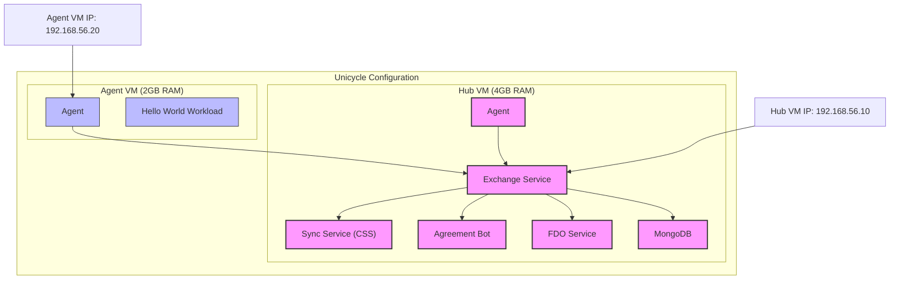
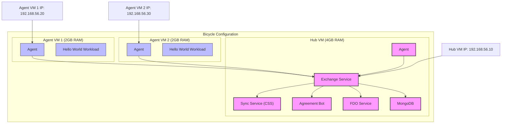
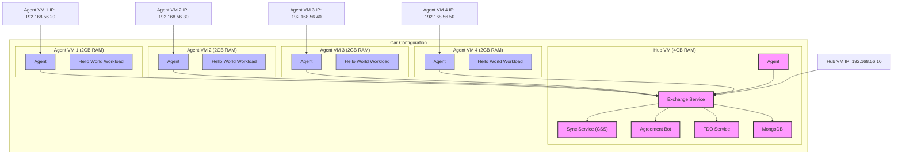
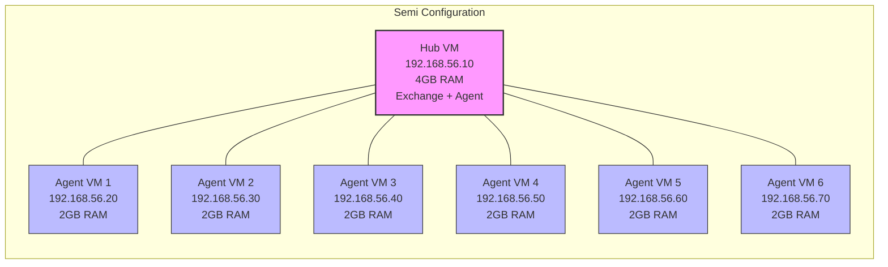
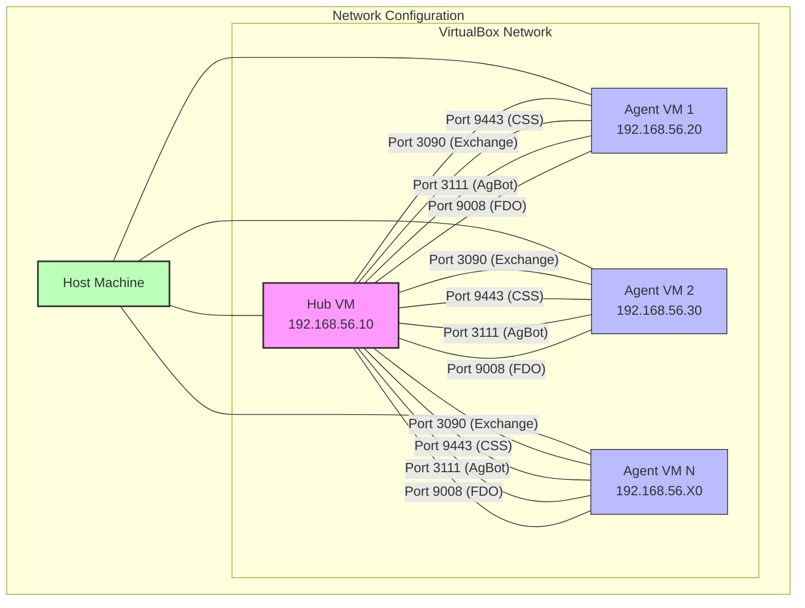

# demo-in-a-box

This is a set of materials designed to allow anyone to create a portable set of computers that will demonstrate most aspects of Open Horizon and OH-delivered applications in a single location. It should contain a Bill of Materials, initial configuration, setup instructions, and examples of how to demonstrate most features.

## Pre-requisites

You must have the following utilities installed in order to provision:

* `make`
* `vagrant`
* `virtualbox`
* `erb` (Ruby's ERB template processor)

Additionally, this must be run on an `x86_64` architecture machine running a Debian-based OS such as Ubuntu.

## System Configurations

The `x86_64` architecture host can be configured one of four ways:

### Unicycle Configuration

Two VMs, with the primary running the Exchange and an Agent using 1/2 of the available resources, and the remaining VM running an Agent also using 1/2 of the available resources.



### Bicycle Configuration

Three VMs, with the primary running the Exchange and an Agent using 1/2 of the available resources, and the remaining two running Agents each using 1/4 of the available resources.



### Car Configuration

Five VMs (recommended for the 16GB RAM configuration only), with the primary running the Exchange and an Agent using 1/4 of the available resources, and the remaining four running Agents each using 1/8 of the available resources.



### Semi Configuration

Seven VMs (recommended for the 16GB RAM configuration only), with the primary running the Exchange and an Agent using 1/4 of the available resources, and the remaining six running Agents each using 1/8 of the available resources.



### Network Configuration

The following diagram shows how the VMs are connected in the network:



### Legend

* **Pink/Purple Nodes**: Hub VM components (Exchange, CSS, AgBot, FDO, MongoDB)
* **Blue Nodes**: Agent VM components
* **Green Node**: Host machine

## Installation

Clone the repository, then `cd` into the repo folder.

Run `make check` to verify dependencies are installed and defaults are correct. Further, run `make status` to confirm that Vagrant is installed and running properly.

Running `make init` will provision the default system configuration ("unicycle"). To use any other configuration, first `export SYSTEM_CONFIGURATION=<system configuration string>` where `<system configuration string>` is one of "unicycle", "bicycle", "car", or "semi" _without the quotes_. Installation should take between 30 minutes for _unicycle_ to an hour for _semi_.

### Advanced Configuration

The system can be further customized by setting the following environment variables:

* `NUM_AGENTS` \- Number of agent VMs to create (default: 1)
* `BASE_IP` \- Starting IP address final value for agent VMs (default: 20)
* `MEMORY` \- Memory allocation per agent VM in MB (default: 2048)
* `DISK_SIZE` \- Disk size per agent VM in GB (default: 20)

Example:

```bash
export SYSTEM_CONFIGURATION=custom
export NUM_AGENTS=4
export BASE_IP=30
export MEMORY=4096
export DISK_SIZE=40
make init
```

If you only want the hub running in a VM with an agent, and not a separate agent in a VM, just run `make up-hub` instead of `make init`, but make sure you copy over the credentials from the "mycreds.env" file on the host.

Running `make down` will de-provision the system and cannot be undone. Make sure you really want to do this.

## Usage

Run `make connect` to SSH to the first agent VM in _unicycle_ configuration. For all other configurations, specify the "VMNAME" as an argument: `make connect VMNAME=agent3`. The credentials can be set by running `export $(cat agent-install.cfg)`. To test that the installation is configured and working, run the following commands:

```shell
hzn version
```

This should return matching version numbers for both the CLI and the agent.

```shell
hzn node list
```

This will show the agent is running and the HelloWorld sample workload is configured and running.

```shell
hzn ex user ls
```

This will confirm that the CLI can connect to the exchange in the hub's VM, and that the credentials are valid.

```shell
hzn ex node ls
```

This will show all of the agents registered with the exchange in the hub VM.

```shell
exit
```

Will disconnect from the agent VM and end the SSH session.

```shell
make down
```

Will remove all of the VMs and delete temporary files.

## EdgeLake Integration

This repository includes enhanced support for EdgeLake services, Grafana monitoring, and PostgreSQL databases. For detailed EdgeLake deployment instructions, see [EDGELAKE_README.md](EDGELAKE_README.md).

### EdgeLake Commands

The Makefile includes additional commands for EdgeLake deployment:

```bash
# Deploy EdgeLake services
make full-deploy EDGELAKE_TYPE=operator

# Deploy Grafana monitoring
make grafana-publish

# Deploy PostgreSQL database
make psql-publish

# Check EdgeLake variables
make check-vars EDGELAKE_TYPE=operator
```

## Advanced details

The system uses a single ERB template (`configuration/Vagrantfile.template.erb`) to generate the Vagrant configuration for all agent VMs. The template supports dynamic configuration through environment variables and maintains consistent IP addressing and resource allocation across all VMs.

### IP Addressing Scheme

Agent VMs are assigned IP addresses following the pattern: `192.168.56.<base_ip + (agent_number - 1) * 10>`. For example:

* Agent 1: 192.168.56.20
* Agent 2: 192.168.56.30
* Agent 3: 192.168.56.40
* And so on...

### Resource Allocation

Each agent VM is configured with:

* Memory: 2048MB (2GB) by default
* Disk: 20GB by default
* CPU: 1 core (default VirtualBox setting)

These values can be customized using the environment variables described in the Advanced Configuration section.